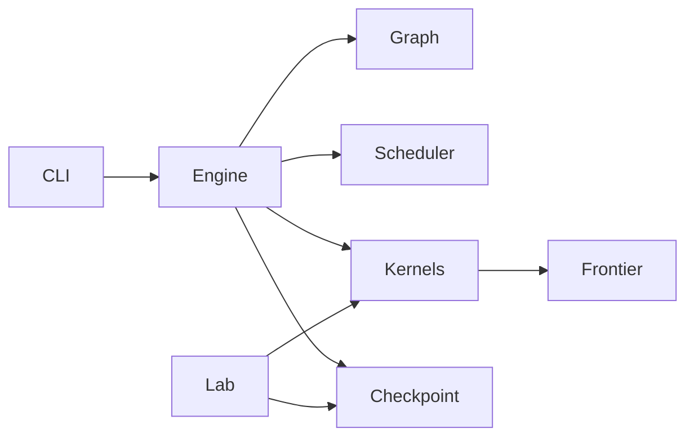

# GraphWeft

Independent C++17/CUDA implementation of concurrent BFS, SSSP and SSWP on one graph. It uses synchronous float32 double buffering, a shared CSR for undirected Push/Pull, and CSR plus CSC for directed graphs. The previous `ocgp/puercgp` project is a reference only; GraphWeft builds on its own.

## Build

```bash
cmake -S . -B build -DCMAKE_BUILD_TYPE=Release -DCMAKE_CUDA_ARCHITECTURES=70
cmake --build build -j
```

CUDA 12.8 and CMake 3.24+ are required. CMake fetches fixed spdlog 1.15.3 and gflags 2.2.2 commits. Fast math is not enabled. Source licenses are copied to `third_party/licenses/`. The shared node warp traversal and scheduling design were informed by `../ocgp/puercgp/include/puercgp/kernels/push/shared_push_kernels.hxx` and `../ocgp/puercgp/include/puercgp/scheduling/online_offset_evaluator.hxx`; the original phase evaluator is copied unchanged to `third_party/puercgp/` with provenance, and no old project binary is linked.

## Input and execution

A graph is either a zero-based text edge list (`src dst [float_weight]`) or a directory with `csr_vlist.bin`, `csr_elist.bin` and optional `csr_weightlist.bin`. The legacy CSR offsets are read as int32 and promoted to uint64. CSR weights default to float32; pass `--legacy_int_weights` for original puercgp CSR files whose weight array contains int32 values. Text edge lists infer V from the largest ID, so use CSR when isolated trailing IDs matter. Undirected input must include an exact matching reverse edge for every edge, including multiplicity and float32 weight bits. Self loops and parallel edges are retained. Directed mode builds incoming CSC.

```bash
./build/graphweft_cli --graph=/path/to/csr --directed --algorithm=sssp --n=256 --q=64 --layout=grouped --group_width=8 --selector=threshold
./build/graphweft_cli --graph=/path/to/csr --directed --algorithm=bfs --n=256 --q=128 --selector=push --frontier=stable --checkpoint=experiments/my_run/artifacts/round.bin
./build/graphweft_kernel_lab /path/to/csr experiments/my_run/artifacts/round.bin experiments/my_run/artifacts/samples.csv 1
```

`--queries` accepts `id,source,score,offset,feature_key,algorithm,reference_rounds` rows; the trailing fields are optional and algorithm is `0=BFS, 1=SSSP, 2=SSWP`. For `--planner=length` or imported `--offsets`, the file must start with `# graph_identity=<hash>` matching the graph identity printed by the CLI. Imported scores sort descending with stable input order for ties; offsets are local batch start rounds. `--planner=length --predictor=core_distance` computes deterministic reverse BFS tiers for BFS, and `--predictor=weighted_boundary` computes reverse shortest-path hop statistics for SSSP. Both automatic feature paths sort ascending at execution time, matching the old feature ordering, and record prediction time separately. `--plan_only --plan_output=...` freezes those keys while preserving the caller's input order, so FIFO controls remain FIFO. These preprocessors can be expensive on large graphs; frozen query files avoid recomputation. `--offsets --offset_source=phase` builds the migrated landmark phase index from the loaded graph and evaluates offsets per batch; use `--landmarks` and `--max_offset` to tune it. SSWP requires imported offsets. FIFO is the default. `--copy_results_to_cpu` enables a per-query callback, and `--output=path.csv` writes its values. Without it, no N×V host result array is created. `--completion_output` writes lightweight completion metadata without enabling result copies. `--auto_q` selects the largest budget-fitting Q up to N; it is a capacity choice, not a performance recommendation. `--memory_fraction` defaults to 0.8 of total GPU memory, also bounded by free memory.

`--same_algorithm_groups` forms strict same-algorithm groups while retaining the legacy whole-batch barrier. `--group_refill` additionally reclaims a group when every member is complete, resets both value buffers and both masks for those physical slots, then fills it from round-robin algorithm queues. The default experiment uses `--q=64 --group_width=8`, i.e. eight resident groups. `--oracle_order` uses imported `reference_rounds` and is diagnostic only. Checkpoints version 2 retain per-slot algorithms; version 1 checkpoints remain readable.

`--completion_output` appends wall-clock `activation_ms`, `completion_ms`, `waiting_ms`, `service_ms`, and `submit_to_completion_ms` columns after the existing logical-round columns. Times start when `run()` receives the submitted workload and are sampled at the executor's existing activation/frontier synchronization points; writing completion metadata adds no GPU synchronization. `--result_fingerprints` is the validation-only full-result path: it computes independent 64-bit sum/xor digests over every `(vertex, value-bit-pattern)` pair on the GPU and copies only two words per query, avoiding an N×V host result export.

The fixed workload workflow is:

```bash
python3 tools/prepare_workloads.py sample --graph GRAPH --identity GRAPH_HASH --output experiments/RUN/workloads
# Freeze predictor keys with --plan_output (core_distance for BFS and weighted_boundary for SSSP),
# then run those two frozen candidate plans with --q=64 --completion_output=... under forced Push.
python3 tools/prepare_workloads.py mixed --identity GRAPH_HASH --output experiments/RUN/workloads \
  --bfs-queries BFS_FROZEN_PLAN.csv --bfs-completion BFS_COMPLETION.csv \
  --sssp-queries SSSP_FROZEN_PLAN.csv --sssp-completion SSSP_COMPLETION.csv \
  --core-index GRAPH.core-distance.bin --weighted-index GRAPH.weighted-boundary-v4.bin
python3 tools/run_fixed_experiments.py --graph GRAPH --queries experiments/RUN/workloads/mixed_tail.csv \
  --output experiments/RUN/results/push_abcd --directed --only=base
python3 tools/run_fixed_experiments.py --graph GRAPH --queries experiments/RUN/workloads/mixed_tail.csv \
  --output experiments/RUN/results/hybrid --directed --only=hybrid
python3 tools/run_fixed_experiments.py --graph GRAPH --queries experiments/RUN/workloads/mixed_tail.csv \
  --output experiments/RUN/results/oracle --directed --only=oracle
python3 tools/run_fixed_experiments.py --graph GRAPH --queries experiments/RUN/workloads/mixed_tail.csv \
  --output experiments/RUN/results/g_sensitivity --directed --only=g
```

The runner performs one warmup and five interleaved measurements, retains completion/event CSVs and raw logs, and emits A/B/C/D, hybrid A/D, oracle, or `G=1/4/8/16/32/64` as separate non-overlapping suites. Here G is the resident group count, so its physical group width is `64/G`. `sample` also creates seed-45 calibration sources disjoint from both the ordinary sources and the seed-43 Mixed-tail candidate pool. Use `tools/run_kernel_comparison.py calibrate` to freeze one of the 30 static mappings on those sources, then `compare` to measure shared, frozen-static, degree, and density production paths with stable frontier inputs.

`tools/run_frontier_comparison.py` replays one frozen workload with interleaved `scan`, `fused`, and `direct` frontier construction. It records kernel, frontier, compare, copy, and end-to-end timings separately and rejects an update-driven run if `compare_kernel` was executed. Direct comparison requires unordered frontier order.

`tools/run_hybrid_mask64_campaign.py` is the fixed five-graph, three-workload campaign for P/H0/A/B/C/D. It binds the five dataset workers to GPUs 0--4, runs one warmup plus five rotated formal repetitions per case, performs small/formal hash gates, and retains commands, logs, completion data, and code identity. Run `tools/summarize_hybrid_mask64_campaign.py CAMPAIGN_DIR` afterward to produce the 90-case result table, mechanism comparisons, wall-clock latency/refill assessment, and reused Gunrock/Groute speedups.

`--selector` supports `threshold`, `push`, `pull`, and `replay` with `--replay=push,pull,...`. Pull partition replay tokens use `pull-check-free-q8_w2` or `pull-check-q8_w2` syntax, with query group 1/2/4/8/16/32 and vertex partition w1/w2/w4/b2/b4. The `qX` token names the number of lanes per incoming edge (`group_size`); the number of edge groups per warp is `32/X`. For example, `q8` has eight lanes per edge and four edge groups per warp. The VM Pull family has six explicit tokens: `pull-vm-serial-q32`, `pull-vm-serial-q16`, `pull-vm-serial-q8`, `pull-vm-parallel-q32`, `pull-vm-parallel-q16`, and `pull-vm-parallel-q8`. For a non-Replay Pull with padded M divisible by 32 and at most 256, M<=32 or E/V<20 selects serial-q32; otherwise parallel-q16 is selected. Other M values use DensePull. This refinement happens only after the existing Push/Pull threshold decision. The legacy `pull-grouped-g8-edge4-warp4` ID uses its original specialization for grouped checkpoint replay and a VM-equivalent q8/w4 mapping in production. Threshold defaults to 0.20 on edge-pair density. A zero-edge graph selects Push. Q defaults to 32; 64-bit mask words cover arbitrary Q. `--frontier=stable` uses CUB selection in vertex order, while `unordered` uses atomic compaction. Both modes preserve the same frontier set. Independently, `--frontier_build=scan|fused|direct` selects frontier construction. The default `scan` compares every old/new value after the graph kernel. `fused` records successful relaxations in the graph kernel and skips that full-value comparison, then compresses flags into a list. `direct` uses a separate per-vertex atomic claim and appends the winning vertex inside the graph kernel; the claim is independent of query-mask words and therefore remains unique for Q greater than 64. Direct construction requires `--frontier=unordered`. Update-driven modes default to `--frontier_mask64=true`: successful updates are aggregated per `(vertex, 64-query word)`, while multiple words use the vertex claim to preserve list uniqueness for M greater than 64. `--frontier_mask64=false` retains the single-slot publication path for controlled A/B tests. All three modes retain the synchronous value-buffer copy.

The six-graph, 211-round Q32 Pull partition study, its raw samples, replay configuration, validation audit, and Nsight Compute counters are in `experiments/20260922-144225_pull_partition_final/`.

## API

```cpp
#include <graphweft/engine.hpp>
using namespace graphweft;
auto graph = HostGraph::load("/path/to/graph", true);
Options options;
options.algorithm = Algorithm::SSSP;
options.capacity = 65;
options.copy_results_to_cpu = true;
std::vector<Query> queries{{0, 12}, {1, 24}};
auto stats = run(graph, queries, options, [](const QueryResult& result) {
  // Consume one query's V values before the next batch is initialized.
});
```

An optional fifth `run` argument accepts a `RoundCallback` for test-only per-round snapshots; it copies one round of values, mask and frontier to the host. The low-level compute interface is `launch(KernelId, const Context&)`; `Context` has read-only old values, writable new values, current frontier/mask, live slots, graph views and stream. Its optional `frontier_output` is null in scan mode and for diagnostic probes. In fused/direct modes, successful relaxations atomically set next-frontier mask words, the exact pair count and an active-query word mask; fused compresses flags after the kernel, while direct atomically claims and appends unique vertices during the kernel. The caller copies old to new before `launch`, then swaps buffers after frontier construction.

## Module dependencies



`graphweft_kernels` is a shared static target for the system and `kernel_lab`; kernel implementations are not duplicated. `--layout=grouped --group_width=G` controls padding and logical group scheduling, while production values are stored physically as `[vertex][padded slot]`. New checkpoints and round snapshots therefore record VertexMajor layout. Kernel launchers retain compile-time Grouped specializations so version 1/2 grouped checkpoints remain replayable without conversion. G=8/16/32 refill uses coalesced VM group-reset kernels; other widths use the general reset path. `src/graph.cpp` owns host topology validation and CSC construction. `src/engine.cpp` owns GPU allocations, batch lifetime and the synchronous round contract. `src/scheduler.cpp` owns stable grouping and online choice. `src/checkpoint.cpp` owns the replay file format.

The CLI reports prediction, planning, initialization, copy, kernel, frontier, feature, selector, transfer and aggregate round times, plus `push_rounds` and `pull_rounds`. `--push_mapping=adaptive` is available only with `--layout=grouped --group_width=32`; it selects q1/q2/q4/q8/q16/q32 independently for each query tile and assigns each frontier vertex to W1/W2/W4/B2/B4 from `out_degree * active_queries`. `--push_mapping=iteration` has the same layout restriction and, on each Push round, uses the embedded quadratic ridge model to select exactly one of the 30 q1...q32 × W1/W2/W4/B2/B4 partition kernels. `tools/run_iteration_calibration.py` and `tools/train_iteration_model.py` create the disjoint seed-45 V100 corpus, audit JSON, and frozen coefficient header; a bootstrap header selects q1_w1 and emits a warning until that workflow is completed. Pull rounds bypass the model, and zero-edge Push rounds deterministically use q1_w1. Other GPUs are allowed with a performance-calibration warning. `adaptive_preparation_ms` reports the vertex-adaptive fused classification and bucket scatter time and is included in `feature_ms`. `kernel_ms` retains its CPU wall-clock/synchronization meaning and includes fused frontier atomics when enabled; `frontier_ms` includes fused state clearing and list compression. `--profile_kernel` additionally reports `kernel_gpu_ms`, the CUDA-event sum around only the production graph kernel(s); `--round_metrics=PATH` enables the same measurement and writes batch, round, work features, exact kernel configuration, GPU and selector times, prediction/model version, adaptive preparation time, and the five adaptive bucket populations as CSV. Both are disabled by default and do not launch a diagnostic graph kernel. `--profile_compare` reports the full-value comparison kernel in scan mode and remains zero in fused mode. `execution_ms` covers the batch loop after state allocation. `task_wall_ms` also includes state allocation, beginning after graph upload. `total_ms` also includes graph upload, beginning after host graph loading. `--binary_query_id` with `--binary_output` exports one query's raw float32 values, while `--result_hashes` emits a digest and completion round for every query without retaining another GPU value matrix. `--checkpoint_round` selects the production input round saved by `--checkpoint` (default zero).

Dense Pull exposes 21 production candidates through canonical `pull-dense-*` tokens. `--pull_kernel=auto` retains the existing slot-aware rule; an explicit token overrides non-Replay Pull rounds, while Replay IDs remain authoritative. Candidates support physical capacities 32 through 256 in steps of 32 and otherwise fall back to the general DensePull kernel. Fused frontier construction is the default; `scan` remains the full-value reference and `direct` remains available with unordered frontiers. Dense round-metric rows include the complete token, serial/parallel mapping, global/SMEM storage, query width, reduction type, and fused flag.

## Memory ledger

`allocation_plan()` is used for the CLI estimate and the executor's budget check. It includes topology, two float32 value buffers with grouped padding, two multiword masks, two frontier lists, flags, per-slot source/live/due/reset/algorithm buffers, group metadata, scalars and CUB storage when stable compression is selected. Adaptive Push additionally accounts for one byte of category and four bytes of bucket storage per vertex plus its small counter arrays, so `--auto_q` uses the same complete ledger. Undirected incoming views alias the outgoing CSR and cost zero additional device bytes. Actual allocation failures retain the CUDA error and buffer name. The host result buffer holds at most one batch and is allocated only when export is enabled. Fixed-M runs fail before allocation when M=64 exceeds the 80% budget; they never reduce M unless `--auto_q` is explicitly requested.

## Semantics and extension

BFS: source 0, unreachable `+∞`, exact integer distances through `2^24`; attempting a further expansion at that boundary raises an error. SSSP: nonnegative finite weights; source 0 and unreachable `+∞`. SSWP: source `+∞`, unreachable `−∞`, max/min relaxation including negative capacities. A query's completion round is measured from activation; the global round is tracked separately. Under the legacy batch barrier a finished slot stays allocated until the entire batch completes; under `--group_refill` it stays allocated until every member of its group completes, after which the whole group is synchronously reclaimed.

To add a kernel, register a new `KernelId`, implement `void new_kernel(const Context&)`, and add dispatch in `launch`. The kernel may write only new values; every successful improvement must also mark `frontier_output` when it is enabled. If scratch space is required, extend `allocation_plan` and preallocate it in `run`. To add a predictor, implement `PredictionProvider::predict` and populate `Query::score` and/or `Query::offset` separately. Keep `BatchPlanner` and `ConfiguredSelector` independent of the round executor.

## Verification

```bash
./build/graphweft_validate
./build/graphweft_frontier_validate
```

Validation includes CPU reference results and per-round value/mask/frontier traces, directed and undirected graphs, zero and negative weights where allowed, duplicate edges, self loops, Q=1/8/32/63/64/65/127/128/129/256, both layouts, both compaction modes, all selectors, delayed start and N=512/1024. `kernel_lab` checks a saved state against both kernels, old-buffer immutability and frontier order independence; it measures one warmup and ten samples per candidate, adding twenty if either IQR/median exceeds 10%. Pass a fifth argument `1` to enable 64 MiB cache eviction outside the timed kernel interval; default is normal cache. Small graph memcheck and synccheck, plus cit-Patents Q128/256 runs, are recorded under `experiments/`.

## Current scope

The scheduler accepts graph-bound frozen scores and offsets, and includes BFS core-distance and SSSP weighted-boundary providers plus the old landmark phase offset evaluator. Core-distance feature keys matched the old cit-Patents index for 32 sources, and weighted-boundary scores matched the old preprocessor for 32 sources on a 4096-vertex integer-weight synthetic graph. Wider parity testing, especially weighted real graphs and noninteger weights, remains open; the weighted provider uses float32 weights and a standard priority queue, while the old preprocessor used uint32 weights and a radix heap. The kernel lab records matched-state core timings with normal or optional cold-cache runs. Register and spill data are captured separately through verbose ptxas builds in `experiments/`; the non-road SSSP end-to-end comparison with original puercgp is recorded in `experiments/`. Execution uses one CUDA stream and supports same-algorithm group replenishment with heterogeneous algorithms resident in different physical groups. Graph reordering remains out of scope.

## Push partition experiments

The shared kernel library also provides 30 experimental Push variants: six warp query-group widths crossed with one/two/four warps or two/four blocks per vertex. `graphweft_push_rounds` measures every real iteration against identical device inputs; the original Push advances the execution trajectory. See [the mapping, protocol and commands](docs/push_partition_study.md). The experiment tool verifies every candidate's complete output and writes raw per-round timing and workload distributions. Its diagnostic wall time is not an end-to-end performance metric.
