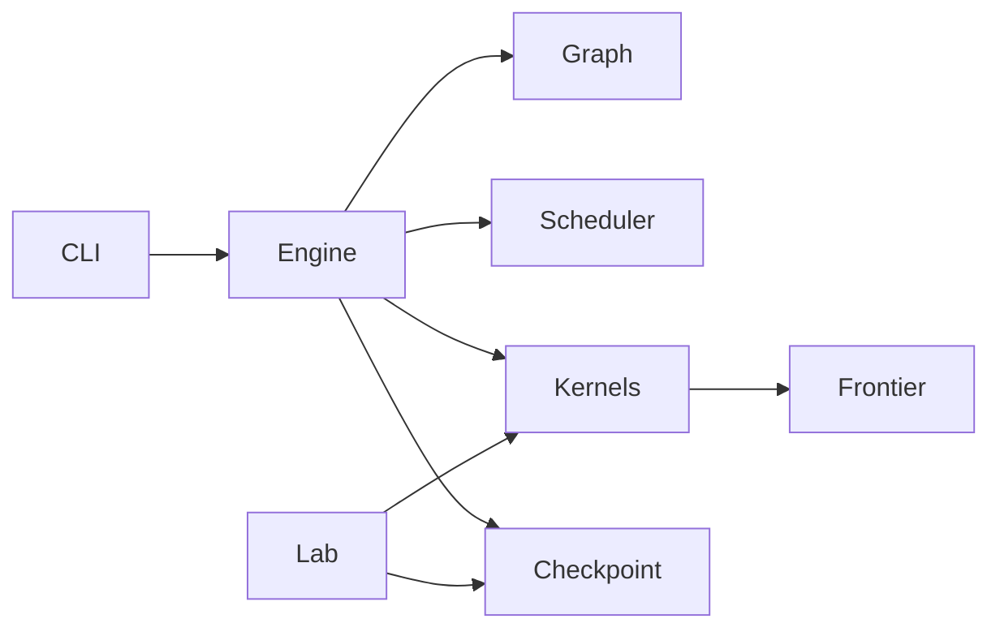

# GraphWeft

Independent C++17/CUDA implementation of concurrent BFS, SSSP and SSWP on one graph. It uses synchronous float32 double buffering, a shared CSR for undirected Push/Pull, and CSR plus CSC for directed graphs. The previous `ocgp/puercgp` project is a reference only; GraphWeft builds on its own.

## Build

```bash
cmake -S . -B build -DCMAKE_BUILD_TYPE=Release -DCMAKE_CUDA_ARCHITECTURES=70
cmake --build build -j
```

CUDA 12.8 and CMake 3.24+ are required. CMake fetches fixed spdlog 1.15.3 and gflags 2.2.2 commits. Fast math is not enabled. Source licenses are copied to `third_party/licenses/`. The shared node warp traversal and scheduling design were informed by `../ocgp/puercgp/include/puercgp/kernels/push/shared_push_kernels.hxx` and `../ocgp/puercgp/include/puercgp/scheduling/online_offset_evaluator.hxx`; the original phase evaluator is copied unchanged to `third_party/puercgp/` with provenance, and no old project binary is linked.

## Input and execution

A graph is either a zero-based text edge list (`src dst [float_weight]`) or a directory with `csr_vlist.bin`, `csr_elist.bin` and optional `csr_weightlist.bin`. The legacy CSR offsets are read as int32 and promoted to uint64. CSR weights default to float32; pass `--legacy_int_weights` for original puercgp CSR files whose weight array contains int32 values. Text edge lists infer V from the largest ID, so use CSR when isolated trailing IDs matter. Undirected input must include an exact matching reverse edge for every edge, including multiplicity and float32 weight bits. Self loops and parallel edges are retained. Directed mode builds incoming CSC.

```bash
./build/graphweft_cli --graph=/path/to/csr --directed --algorithm=sssp --n=256 --q=64 --layout=grouped --group_width=8 --selector=threshold
./build/graphweft_cli --graph=/path/to/csr --directed --algorithm=bfs --n=256 --q=128 --selector=push --frontier=stable --checkpoint=experiments/my_run/artifacts/round.bin
./build/graphweft_kernel_lab /path/to/csr experiments/my_run/artifacts/round.bin experiments/my_run/artifacts/samples.csv 1
```

`--queries` accepts `id,source,score,offset` rows. For `--planner=length` or imported `--offsets`, the file must start with `# graph_identity=<hash>` matching the graph identity printed by the CLI. Imported scores sort descending with stable input order for ties; offsets are local batch start rounds. `--planner=length --predictor=core_distance` computes deterministic reverse BFS tiers for BFS, and `--predictor=weighted_boundary` computes reverse shortest-path hop statistics for SSSP. Both automatic feature paths sort ascending, matching the old feature ordering, and record prediction time separately. These preprocessors can be expensive on large graphs; frozen query files avoid recomputation. `--offsets --offset_source=phase` builds the migrated landmark phase index from the loaded graph and evaluates offsets per batch; use `--landmarks` and `--max_offset` to tune it. SSWP requires imported offsets. FIFO is the default. `--copy_results_to_cpu` enables a per-query callback, and `--output=path.csv` writes its values. Without it, no N×V host result array is created. `--auto_q` selects the largest budget-fitting Q up to N; it is a capacity choice, not a performance recommendation. `--memory_fraction` defaults to 0.8 of total GPU memory, also bounded by free memory.

`--selector` supports `threshold`, `push`, `pull`, and `replay` with `--replay=push,pull,...`. Pull partition replay tokens use `pull-check-free-q8_w2` or `pull-check-q8_w2` syntax, with query group 1/2/4/8/16/32 and vertex partition w1/w2/w4/b2/b4. The `qX` token names the number of lanes per incoming edge (`group_size`); the number of edge groups per warp is `32/X`. For example, `q8` has eight lanes per edge and four edge groups per warp. The experimental `pull-grouped-g8-edge4-warp4` token assigns those same four edge streams to four warps in one block and requires `--layout=grouped --group_width=8`. Threshold defaults to 0.20 on edge-pair density. A zero-edge graph selects Push. Q defaults to 32; 64-bit mask words cover arbitrary Q. `--frontier=stable` uses CUB selection in vertex order, while `unordered` uses atomic compaction. Both modes preserve the same frontier set.

The six-graph, 211-round Q32 Pull partition study, its raw samples, replay configuration, validation audit, and Nsight Compute counters are in `experiments/20260922-144225_pull_partition_final/`.

## API

```cpp
#include <graphweft/engine.hpp>
using namespace graphweft;
auto graph = HostGraph::load("/path/to/graph", true);
Options options;
options.algorithm = Algorithm::SSSP;
options.capacity = 65;
options.copy_results_to_cpu = true;
std::vector<Query> queries{{0, 12}, {1, 24}};
auto stats = run(graph, queries, options, [](const QueryResult& result) {
  // Consume one query's V values before the next batch is initialized.
});
```

An optional fifth `run` argument accepts a `RoundCallback` for test-only per-round snapshots; it copies one round of values, mask and frontier to the host. The low-level compute interface is `launch(KernelId, const Context&)`; `Context` has read-only old values, writable new values, current frontier/mask, live slots, graph views and stream. It has no next-frontier output. `build_frontier` compares all old/new values, constructs mask words and compresses vertex flags. The caller copies old to new before `launch`, then swaps buffers after `build_frontier`.

## Module dependencies



`graphweft_kernels` is a shared static target for the system and `kernel_lab`; kernel implementations are not duplicated. `src/graph.cpp` owns host topology validation and CSC construction. `src/engine.cpp` owns GPU allocations, batch lifetime and the synchronous round contract. `src/scheduler.cpp` owns stable grouping and online choice. `src/checkpoint.cpp` owns the replay file format.

The CLI reports prediction, planning, initialization, copy, kernel, frontier, feature, selector, transfer and aggregate round times, plus `push_rounds` and `pull_rounds`. `kernel_ms` retains its CPU wall-clock/synchronization meaning. `--profile_kernel` additionally reports `kernel_gpu_ms`, the CUDA-event sum around only the production graph kernel; `--round_metrics=PATH` enables the same measurement and writes batch, round, live-query count, exact kernel configuration, and GPU time as CSV. Both are disabled by default and do not launch a second kernel. `--profile_compare` similarly reports `compare_ms` for the full-value comparison kernel. `execution_ms` covers the batch loop after state allocation. `task_wall_ms` also includes state allocation, beginning after graph upload. `total_ms` also includes graph upload, beginning after host graph loading. `--binary_query_id` with `--binary_output` exports one query's raw float32 values, while `--result_hashes` emits a digest and completion round for every query without retaining another GPU value matrix. `--checkpoint_round` selects the production input round saved by `--checkpoint` (default zero).

## Memory ledger

`allocation_plan()` is used for the CLI estimate and the executor's budget check. It includes topology, two float32 value buffers with grouped padding, two multiword masks, two frontier lists, flags, per-slot buffers, scalars and CUB storage when stable compression is selected. Undirected incoming views alias the outgoing CSR and cost zero additional device bytes. Actual allocation failures retain the CUDA error and buffer name. The host result buffer holds at most one batch and is allocated only when export is enabled.

## Semantics and extension

BFS: source 0, unreachable `+∞`, exact integer distances through `2^24`; attempting a further expansion at that boundary raises an error. SSSP: nonnegative finite weights; source 0 and unreachable `+∞`. SSWP: source `+∞`, unreachable `−∞`, max/min relaxation including negative capacities. A query's completion round is measured from activation; the batch round is tracked separately. A finished slot stays allocated until the entire batch completes.

To add a kernel, register a new `KernelId`, implement `void new_kernel(const Context&)`, and add dispatch in `launch`. The kernel may write only new values. If scratch space is required, extend `allocation_plan` and preallocate it in `run`. To add a predictor, implement `PredictionProvider::predict` and populate `Query::score` and/or `Query::offset` separately. Keep `BatchPlanner` and `ConfiguredSelector` independent of the round executor.

## Verification

```bash
./build/graphweft_validate
./build/graphweft_frontier_validate
```

Validation includes CPU reference results and per-round value/mask/frontier traces, directed and undirected graphs, zero and negative weights where allowed, duplicate edges, self loops, Q=1/8/32/63/64/65/127/128/129/256, both layouts, both compaction modes, all selectors, delayed start and N=512/1024. `kernel_lab` checks a saved state against both kernels, old-buffer immutability and frontier order independence; it measures one warmup and ten samples per candidate, adding twenty if either IQR/median exceeds 10%. Pass a fifth argument `1` to enable 64 MiB cache eviction outside the timed kernel interval; default is normal cache. Small graph memcheck and synccheck, plus cit-Patents Q128/256 runs, are recorded under `experiments/`.

## Current scope

The scheduler accepts graph-bound frozen scores and offsets, and includes BFS core-distance and SSSP weighted-boundary providers plus the old landmark phase offset evaluator. Core-distance feature keys matched the old cit-Patents index for 32 sources, and weighted-boundary scores matched the old preprocessor for 32 sources on a 4096-vertex integer-weight synthetic graph. Wider parity testing, especially weighted real graphs and noninteger weights, remains open; the weighted provider uses float32 weights and a standard priority queue, while the old preprocessor used uint32 weights and a radix heap. The kernel lab records matched-state core timings with normal or optional cold-cache runs. Register and spill data are captured separately through verbose ptxas builds in `experiments/`; the non-road SSSP end-to-end comparison with original puercgp is recorded in `experiments/`. This version uses one CUDA stream and does not support slot replenishment, heterogeneous mixing, or graph reordering.

## Push partition experiments

The shared kernel library also provides 30 experimental Push variants: six warp query-group widths crossed with one/two/four warps or two/four blocks per vertex. `graphweft_push_rounds` measures every real iteration against identical device inputs; the original Push advances the execution trajectory. See [the mapping, protocol and commands](docs/push_partition_study.md). The experiment tool verifies every candidate's complete output and writes raw per-round timing and workload distributions. Its diagnostic wall time is not an end-to-end performance metric.
