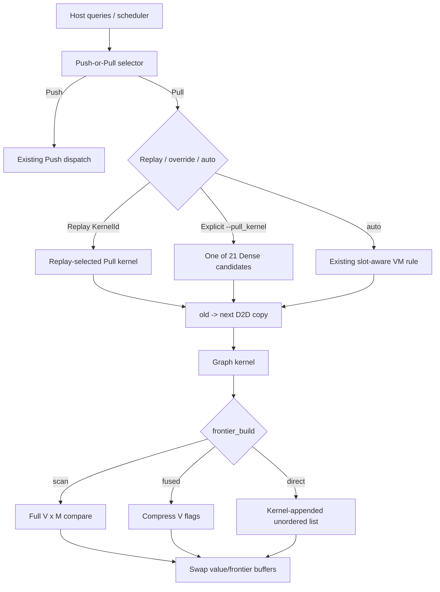

# Dense Pull Integration：系统设计与接手指南

## 1. 文档目的

本文描述分支 `experiment/dense-pull-integration` 的系统设计，供后续 agent
在不重新推断历史背景的情况下继续开发、验证和设计 adaptive Pull selector。

对应代码状态：

- 仓库：`/home/zyl/Projects/GraphWeft`
- 基线分支：`experiment/vm-group-storage`
- 当前分支：`experiment/dense-pull-integration`
- 集成提交：`354e782edb9187e30cfc6e9de3eaf92dfd09aa3f`
- 提交说明：`feat(pull): integrate dense kernel frontier`

本分支完成的是候选 kernel 的生产化集成和测量基础设施。它**没有**训练或固化
新的 adaptive Pull selector。

## 2. 目标与非目标

### 已实现目标

1. 将 `kernel_lab` 的 21 个 Vertex-Major Dense Pull 候选接入生产 dispatch。
2. 保留旧 KernelId、checkpoint 和 replay ABI，不重编号历史 ID。
3. 支持显式 `--pull_kernel=TOKEN`，同时保留旧 `auto` 规则。
4. 为 Dense Pull 接入 Scan、Fused 和 Direct 三种 frontier 构建方式。
5. 支持 BFS、SSSP、SSWP，以及同一 resident batch 内的混合算法。
6. 保留 Push/Pull 阈值、group mapping、refill admission 和 Iteration Push 语义。
7. 输出足够的 round metrics，用于下一阶段的候选选择与训练。

### 明确非目标

- 本分支不根据数据集名称硬编码 winner。
- 本分支不把性能实验中的 oracle winner 写入 `auto`。
- 本分支不改变 Push/Pull 大方向的选择阈值。
- 本分支不改变 query 顺序、refill 策略或 Push kernel 模型。
- 性能不是正确性合入门槛；所有候选必须先保持完全一致的执行语义。

## 3. 关键术语

| 名称 | 含义 |
|---|---|
| `N` | 一次提交的总 query 数，可以大于 GPU resident capacity |
| `Q` | resident query capacity；CLI 参数 `--q` |
| `M` / physical slots | value matrix 的物理 query stride；Dense 候选按该值编译期特化 |
| `G` / group width | refill/scheduling 的逻辑 group 大小；CLI 参数 `--group_width` |
| query width | 一个 incoming edge 使用的 warp lanes 数，取 32、16 或 8；token 中的 Q32/Q16/Q8 指此值，不是 resident `Q` |
| Serial | 一个 warp 负责一个 target，并串行处理多个 32-query tile |
| Parallel | 一个 block 负责一个 target，不同 warp 并行负责不同 query tile |
| Fused serial | 一个 warp 在一次完整邻接遍历中维护所有 accumulator tile |
| SMEM | incoming row 的 source/weight tile 被缓存到 shared memory |
| Shared reduction | edge-group partials 通过 shared memory 合并 |
| Shuffle reduction | edge-group partials通过 warp shuffle 合并 |

尤其注意：token 中的 `q32/q16/q8` 是 **query width**，不是 `--q`。

## 4. 总体执行路径



每轮执行保持同步 double-buffer 语义：

1. 先执行 `next = old` 的 device-to-device copy。
2. graph kernel 只写 improved values。
3. 根据 frontier 模式生成下一轮 mask/list/count。
4. 检查完成 slots，更新 live 状态。
5. 交换 old/next 和 current/next frontier buffers。

## 5. 数据布局

生产 value arrays 始终物理存储为：

```text
values[vertex][physical_slot]
index = vertex * M + slot
```

即使用户传入 `--layout=grouped`，`Options::layout` 目前也是 scheduling/padding
contract；`src/engine.cpp` 中的实际 `storage_layout` 固定为
`Layout::VertexMajor`。不要根据 CLI 的 layout 字符串推断物理 value layout。

Dense 候选支持：

```text
M = 32, 64, 96, 128, 160, 192, 224, 256
```

如果显式 Dense token 遇到不支持的 M，executor 回退到历史通用
`KernelId::DensePull`，不会改变 capacity。

## 6. 21 个生产候选

| Family | Storage | Query width | Reduction | Canonical token |
|---|---|---:|---|---|
| Fused Serial | Global | 32 | none | `pull-dense-fused-serial-global-q32` |
| Fused Serial | Global | 16 | shuffle | `pull-dense-fused-serial-global-q16` |
| Fused Serial | Global | 8 | shuffle | `pull-dense-fused-serial-global-q8` |
| Fused Serial | SMEM | 32 | none | `pull-dense-fused-serial-smem-q32` |
| Fused Serial | SMEM | 16 | shuffle | `pull-dense-fused-serial-smem-q16` |
| Fused Serial | SMEM | 8 | shuffle | `pull-dense-fused-serial-smem-q8` |
| Serial | Global | 16 | shared | `pull-dense-serial-shared-q16` |
| Serial | Global | 8 | shared | `pull-dense-serial-shared-q8` |
| Serial | Global | 16 | shuffle | `pull-dense-serial-shuffle-q16` |
| Serial | Global | 8 | shuffle | `pull-dense-serial-shuffle-q8` |
| Serial | SMEM | 32 | none | `pull-dense-serial-smem-q32` |
| Serial | SMEM | 16 | shuffle | `pull-dense-serial-smem-shuffle-q16` |
| Serial | SMEM | 8 | shuffle | `pull-dense-serial-smem-shuffle-q8` |
| Parallel | Global | 32 | none | `pull-dense-parallel-global-q32` |
| Parallel | Global | 16 | shared | `pull-dense-parallel-shared-q16` |
| Parallel | Global | 8 | shared | `pull-dense-parallel-shared-q8` |
| Parallel | Global | 16 | shuffle | `pull-dense-parallel-shuffle-q16` |
| Parallel | Global | 8 | shuffle | `pull-dense-parallel-shuffle-q8` |
| Parallel | SMEM | 32 | none | `pull-dense-parallel-smem-q32` |
| Parallel | SMEM | 16 | shuffle | `pull-dense-parallel-smem-shuffle-q16` |
| Parallel | SMEM | 8 | shuffle | `pull-dense-parallel-smem-shuffle-q8` |

六个原有 VM KernelId（401--406）被复用为其中六个候选。其 canonical token
改为 `pull-dense-*`，但旧 `pull-vm-*` token 仍可解析，保证 replay 兼容。
其余新增 Dense KernelId 从 500 开始。ID 0--406 是 checkpoint/replay ABI，禁止
重编号。

## 7. Kernel 热循环与算法语义

Dense 候选刻意保持 `kernel_lab` 的规则化热循环：

- 遍历 target 的完整 incoming adjacency。
- 连续读取 `old[source * M + slot]`。
- 热循环中不检查 `live_slots`。
- 热循环中不检查 reachable。
- 热循环中不修改 frontier。

BFS/SSSP 使用 `+INFINITY`，SSWP 使用 `-INFINITY` 作为不可达 identity。
不可达输入参与 relax 后仍保持 identity，因此可以安全移除 reachable 分支。

BFS 继续保留 float32 精确整数边界检查：如果扩展距离达到 `2^24`，kernel
设置 error flag，host 抛出错误。

算法 dispatch 有两条路径：

- 同算法 active slots：使用 BFS、SSSP 或 SSWP 的编译期 specialization。
- 混合算法 active slots：使用 per-slot algorithm fallback；算法分支在相同
  query tile 内保持一致的 lane 行为。

## 8. Dense epilogue 与 frontier 发布

每个 accumulator 完成 reduction 后进入 epilogue：

1. 检查输出 slot 是否 live。
2. 将 reduced value 与 `old[target, slot]` 比较。
3. improved 时写 `next[target, slot]`。
4. update-driven frontier 模式下发布 mask/flag/count。

该设计保证 live 检查和 frontier 原子操作不进入 edge-query 热循环。

### Scan

- graph kernel 不发布 frontier。
- kernel 后执行完整 `V × M` compare。
- 是旧语义和正确性参考路径。

### Fused（默认）

- kernel 在 improved 时发布 mask 和 vertex flag。
- kernel 后只压缩 `V` 个 flags，不扫描 values。
- 支持 Stable 和 Unordered frontier。

### Direct

- kernel 在 improved 时发布 mask。
- 第一次更新某 vertex 的线程通过 claim 直接 append vertex。
- 只允许 Unordered frontier。
- vertex claim 独立于 query mask words，因此 M > 64 时仍无重复 vertex。

### mask64

默认 `--frontier_mask64=true`。更新按 `(vertex, 64-query word)` 聚合：

- Serial 在本地合并两个 32-query tile，再按 word 发布。
- Parallel 先生成每个 tile 的 ballot，再由 block 合并同一 word。
- `false` 时回到逐 slot 的 legacy `mark_frontier`，仅用于回归/A-B 测试。

## 9. Pull kernel 选择优先级

Pull kernel refinement 不改变 scheduler 已经做出的 Push/Pull 决策。

优先级如下：

1. **Replay KernelId**：最高优先级；按 replay 序列原样执行。
2. **显式 `--pull_kernel=TOKEN`**：用于非 Replay selector 已选择的 Pull round。
3. **`--pull_kernel=auto`**：保留历史 slot-aware VM 规则。

当前 auto 规则位于 `default_pull_kernel()`：

```text
if M <= 32 or mean_indegree < 20:
    fused-serial-smem-q32
else:
    parallel-smem-shuffle-q16
```

该规则并不会在 21 个候选中自适应搜索。性能实验中报告的 winner 是离线
oracle winner，不是当前 runtime auto 的选择结果。

## 10. Refill 与 Dense Pull 的关系

Refill 使用逻辑 group width `G`；Dense kernel specialization 使用物理 capacity
`M`。二者是不同维度。

- `N`：总 query 数。
- `Q`：resident capacity。
- `G`：每个 scheduling/refill group 的 slot 数。
- `group_refills`：成功 admitted 的 group 数，不是计时调用次数。
- `recycle_ms`：reclaim wave 的聚合 host wall time，不是纯 reset kernel 时间。

`recycle_ms` 还包含 Q-wide slot bookkeeping/upload、mask 清理、同步以及最终
retirement wave。不要用 `recycle_ms / group_refills` 解释纯粹的单 group reset
延迟；若需要该指标，应为 `reset_slot_range()` 单独增加 CUDA events。

生产物理 values 是 VM。对 `G=8/16/32`，`reset_slot_range()` 使用对应的
coalesced VM group reset kernel。

本分支没有修改 refill admission、SSSP wave refill、interference-aware refill
或 bridge refill 的决策逻辑。

### Adaptive campaign sampling policy

后续数据采集分为两层，且 probe 从不提交状态，因此不会改变生产 Hybrid 的轨迹：

1. 所有数据集的每个迭代轮次都执行 paired probe：已有 Iteration Push 模型预测的
   Push partition，加固定的 `pull-dense-parallel-smem-q32`。无论生产 Hybrid 当轮
   选择 Push 还是 Pull，两者都从完全相同的 old values、frontier、live slots 和
   query mapping 开始执行，并比较输出 fingerprint/frontier。
2. 代表性数据集执行 core probe：完整测试 30 个静态 Push、SharedPush、
   AdaptivePush 和 21 个 Dense Pull，共 53 个候选。当前代表集为
   `soc-orkut`、`uk-2002`、`graph500-scale23-ef16-adj` 和 `delaunay-n24`，分别覆盖
   social、web、synthetic power-law 和 planar 结构。

CLI 使用 `--round_oracle_profile=paired|core`。paired Pull 可通过
`--round_oracle_pull_kernel=TOKEN` 显式调整；默认 token 是上述跨图表现较稳健的
parallel SMEM Q32 候选。分析输出同时保留 best Push、best Pull、全局 winner、
生产 Hybrid 的方向及方向 regret，用于判断 Push/Pull 阈值是否合理。

远程 campaign 只运行 `none` 和 `eager_global` refill；后续实验不再运行
`eager_group`。两类 profile 分别写入 `oracle_paired/` 和 `oracle/`，避免断点续跑时
混合候选集合。一次完整 core 结果可以满足 paired 覆盖要求，反向则不成立。

## 11. 指标与可观测性

`--profile_kernel` 使用 CUDA event 累加生产 graph kernel 的 GPU 时间。

`--round_metrics=PATH` 同时启用 kernel profiling，并为每轮记录：

- 完整 kernel token 和 KernelId。
- serial/parallel mapping。
- global/SMEM storage。
- query width。
- reduction 类型。
- fused 标记。
- frontier、vertex-pair、edge-pair 与 density 特征。
- live query 数、mean active queries、mean degree。
- selector 时间及已有 Iteration Push 模型字段。

主要聚合指标：

| 指标 | 含义 |
|---|---|
| `kernel_gpu_ms` | 仅 graph kernel 的 CUDA-event 累计时间 |
| `kernel_ms` | graph kernel launch + host synchronization wall time |
| `frontier_ms` | frontier prepare/finish/compare/compaction 的累计时间 |
| `copy_ms` | 每轮 old-to-next D2D copy |
| `recycle_ms` | group reclaim/refill wave 的聚合 wall time |
| `execution_ms` | device state 分配后的 batch execution loop |
| `task_wall_ms` | 包含 state allocation，不含 graph upload |
| `total_ms` | 包含 graph upload，不含 host graph load |

## 12. 正确性与性能证据

### 正确性

实验：`experiments/20261007-003436_dense_pull_validation/`

- 21 个 Dense candidates。
- 630 条 Dense trajectories。
- M=32/64/96/128/160/192/224/256。
- BFS、SSSP、SSWP 和 mixed algorithms。
- Scan/Fused/Direct。
- mask64 on/off。
- values、mask、frontier set/order、completion round 和 round count 对齐。
- legacy Pull partitions：3660 trajectories、36960 rounds，未回归。
- Compute Sanitizer errors：0。

### 生产候选选择

实验：

- `experiments/20261007-013347_dense_pull_orkut_indochina/`
- `experiments/20261007-140133_dense_pull_dataset_selection/`

Pure Pull SSSP 的实测 oracle winner：

| Dataset | Q=64 | Q=128 |
|---|---|---|
| cit-Patents | fused-serial-smem-q32 | parallel-smem-q32 |
| LiveJournal | fused-serial-smem-q32 | fused-serial-smem-q32 |
| Orkut | parallel-smem-q32 | parallel-smem-q32 |
| indochina | parallel-smem-q32 | parallel-smem-q32 |

这验证了生产 winner 会随数据集和 Q 改变，但也显示 `kernel_lab` 的 exact token
不能直接复制到生产：lab 中常见的 parallel-smem-shuffle-q16 在完整生产轨迹中
转为 parallel-smem-q32；cit-Patents 还在 Q=64/128 间发生 serial/parallel 反转。

LiveJournal Q128 和 indochina Q128 的 winner margin 分别只有约 0.38% 和
0.05%，应视为选择边界，而不是稳定硬标签。

## 13. 常用命令

构建：

```bash
cd /home/zyl/Projects/GraphWeft
cmake -S . -B build -DCMAKE_BUILD_TYPE=Release -DCMAKE_CUDA_ARCHITECTURES=70
cmake --build build -j
```

显式运行一个 Dense candidate：

```bash
./build/graphweft_cli \
  --graph=/home/zyl/data/csr_data/soc-orkut \
  --directed --legacy_int_weights \
  --algorithm=sssp --n=64 --q=64 \
  --selector=pull \
  --pull_kernel=pull-dense-parallel-smem-q32 \
  --frontier=unordered --frontier_build=fused \
  --profile_kernel
```

Replay 一个显式 Dense kernel：

```bash
./build/graphweft_cli ... \
  --selector=replay \
  --replay=pull-dense-fused-serial-smem-q32
```

验证：

```bash
CUDA_VISIBLE_DEVICES=0 ./build/graphweft_validate
CUDA_VISIBLE_DEVICES=0 ./build/graphweft_pull_partition_validate
```

## 14. 代码导航

| 文件 | 责任 |
|---|---|
| `include/graphweft/kernels.hpp` | KernelId、21 候选表、token API、Context/FrontierOutput |
| `src/kernels.cu` | Dense kernels、算法 specialization、epilogue、token parser、dispatch |
| `include/graphweft/engine.hpp` | Options、RunStats、pull override 配置 |
| `src/engine.cpp` | 选择优先级、每轮 copy/launch/frontier、metrics、refill orchestration |
| `app/main.cpp` | `--pull_kernel`、replay token 和 frontier CLI |
| `kernel_lab/profile_pull.cpp` | checkpoint 上的候选 profiling |
| `kernel_lab/pull_wide_smem_shuffle.md` | kernel_lab 设计与历史单 kernel 结果 |
| `tests/pull_partitions.cpp` | 候选 trajectory/frontier/replay/fallback 验证 |
| `tests/validate.cpp` | executor、混合算法、refill 和结果验证 |

## 15. 后续工作的正确入口

下一阶段是设计 production adaptive Pull selector。建议：

1. 以生产 round metrics 为训练数据，不直接使用数据集名称。
2. 将 `M/Q`、mean indegree、round frontier density、active-slot ratio 和算法类型
   纳入特征候选。
3. 先预测 kernel family（fused serial / parallel），再决定 storage/reduction，
   避免直接拟合 21 类造成稀疏标签。
4. 对小于约 1% 的差距采用 tie/confidence policy，优先选择更稳定或资源更低的
   kernel。
5. 训练、冻结和验证 selector 应在新分支中进行；不要修改本分支的历史实验
   结论。

## 16. 接手时的检查清单

- 确认当前分支是 `experiment/dense-pull-integration`。
- 不要重编号 KernelId 0--406。
- 不要把 token 中的 Q32/Q16/Q8 当作 resident `--q`。
- 不要把 `Options::layout=Grouped` 当作物理 grouped value layout。
- 不要把 oracle winner 误认为当前 auto selector。
- 不要用 aggregate `recycle_ms / group_refills` 声称纯 reset latency。
- 修改 epilogue 后至少覆盖 Scan/Fused/Direct、mask64 on/off、Stable/Unordered。
- 修改算法路径后覆盖 BFS 的 `2^24` guard、SSSP、SSWP 和 mixed batch。
- 修改 dispatch 后验证 replay ABI、旧 `pull-vm-*` aliases 和 unsupported-M fallback。
