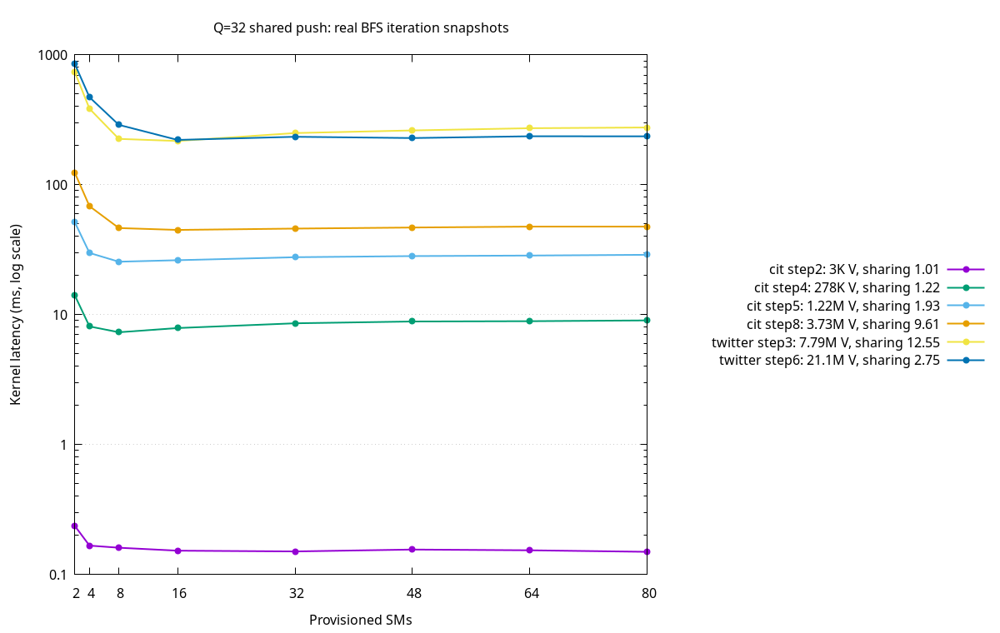
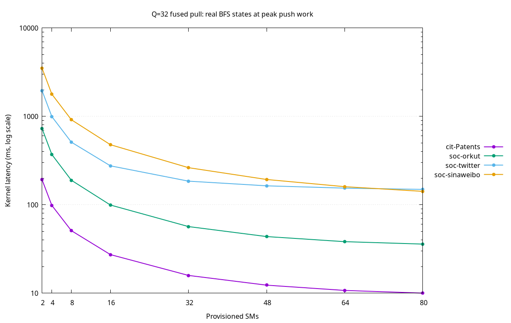

# Green Context SM-scaling study

## Goal

Measure how the production Q=32 BFS push and pull kernels scale when provisioned
with different numbers of SMs. Push inputs are real shared-frontier iterations,
not synthetic random masks. Pull inputs are real BFS value/visited states.

## Platform and method

- GPU: Tesla V100-SXM2-32GB, 80 SMs, compute capability 7.0
- CUDA toolkit and driver API: 12.8
- Green Context SM counts: 2, 4, 8, 16, 32, 48, 64, 80
- Every requested count was verified to equal `CUdevSmResource.smCount` returned
  by the driver.
- Query count: Q=32, 32 distinct sources, seed 42
- Graphs: cit-Patents, soc-orkut, soc-twitter, soc-sinaweibo

The benchmark creates the partition with `cuDevSmResourceSplitByCount`, creates
a green context and green stream, and launches kernels on that stream. CUDA
12.8 requires Volta partitions to contain at least two SMs and use multiples of
two. See the [CUDA 12.8 Green Context documentation](https://docs.nvidia.com/cuda/archive/12.8.0/cuda-driver-api/group__CUDA__GREEN__CONTEXTS.html).

Push latency is the median of five complete deterministic BFS replays. Pull
latency uses one warmup and the median of three measured launches. Initialization,
snapshot restore, trace collection, and Green Context creation are excluded from
kernel latency.

## Kernels

Push measures the production homogeneous BFS kernel:

```text
expand_shared_node_warp_kernel<bfs_policy>
```

Pull measures the production Q<=64 path:

```text
fused_pull_simple_kernel<bfs_policy>
```

## Real push workloads

All BFS iterations for all four graphs are available in `push_raw/`. Six
snapshots were selected to cover different frontier sizes, edge work, and
query overlap. Sharing is virtual per-query edge work divided by physical union
edge work.

| Case | Frontier vertices | Union edges | Sharing | Best SMs | Best ms | 80-SM ms |
|---|---:|---:|---:|---:|---:|---:|
| cit step 2 | 3,413 | 91,451 | 1.01x | 80 | 0.150 | 0.150 |
| cit step 4 | 277,542 | 5,328,982 | 1.22x | 8 | 7.324 | 9.035 |
| cit step 5 | 1,222,112 | 17,617,068 | 1.93x | 8 | 25.574 | 28.908 |
| cit step 8 | 3,730,284 | 32,973,397 | 9.61x | 16 | 44.921 | 47.640 |
| twitter step 3 | 7,793,473 | 478,936,133 | 12.55x | 16 | 217.273 | 276.079 |
| twitter step 6 | 21,118,570 | 529,047,149 | 2.75x | 16 | 221.447 | 236.045 |



### Push finding

Push scaling is non-monotonic. Tiny frontiers do not have enough work to make
SM allocation important. Medium and large frontiers reach their best latency
at 8 or 16 SMs; provisioning all 80 SMs is 6.0%-27.1% slower than the optimum.

The likely cause is contention rather than insufficient grid parallelism. The
kernel scatters active query masks through `atomicOr` operations on visited and
next-frontier masks. More SMs increase the number of concurrently contending
edge updates. The graph and union edge count remain identical across the curve,
while latency rises after 8-16 SMs. Confirming the mechanism requires an NCU
follow-up with atomic serialization and memory-system metrics.

## Real pull workloads

For each graph, the iteration with maximum push union edge work was selected.
The benchmark replays push BFS to the start of that iteration, snapshots the
real `values` and `visited_mask`, restores the snapshot before every launch,
and times only fused pull. The selected steps are cit 8, orkut 4, twitter 6,
and sinaweibo 4.

| SMs | cit-Patents ms | soc-orkut ms | soc-twitter ms | soc-sinaweibo ms |
|---:|---:|---:|---:|---:|
| 2 | 191.934 | 728.945 | 1953.630 | 3507.760 |
| 4 | 98.398 | 370.475 | 995.194 | 1784.880 |
| 8 | 50.930 | 189.407 | 510.746 | 915.965 |
| 16 | 27.305 | 99.335 | 275.754 | 478.093 |
| 32 | 15.866 | 56.654 | 184.987 | 262.782 |
| 48 | 12.314 | 43.675 | 163.817 | 193.197 |
| 64 | 10.735 | 38.235 | 154.266 | 160.180 |
| 80 | 10.007 | 35.899 | 149.219 | 141.750 |



### Pull finding

Pull latency decreases monotonically with additional SMs. Scaling is close to
linear at low SM counts and then becomes bandwidth limited. Moving from 2 to 80
SMs improves latency by 13.1x-24.7x. Moving from 32 to 80 SMs still improves it
by 1.24x-1.85x, depending on graph.

## Implication for resource partitioning

Push and pull should not receive the same fixed SM quota:

- Shared push often saturates at 8-16 SMs and can regress with more SMs.
- Pull continues to benefit from 48-80 SMs because it performs a regular,
  graph-wide gather over Q=32 values.
- A concurrent hybrid design should provision a small push partition and give
  the remaining SMs to pull, then tune the split by current push workload.
- Frontier size alone is insufficient for push quota selection. Union edge work
  and contention/sharing indicators are also required.

This experiment measures isolated kernel scaling. It does not yet measure
simultaneous push/pull execution, shared-memory-bandwidth interference, Green
Context creation overhead, or end-to-end hybrid traversal performance.

## Artifacts

- `push_raw/*.csv`: every real BFS iteration at every SM count
- `pull_raw/*.csv`: pull curves from real BFS states
- `push_selected.csv`: six representative push workloads
- `push_sm_scaling.png`, `pull_sm_scaling.png`: performance curves
- `plot_scaling.gnuplot`: reproducible plotting script
- `examples/bench_push_sm_scaling.cu`: push benchmark
- `examples/bench_pull_sm_scaling.cu`: pull benchmark
- `include/puercgp/core/green_context.hxx`: Green Context wrapper
